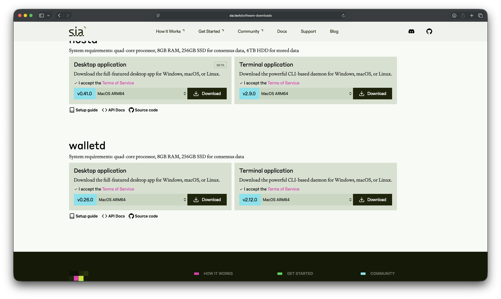
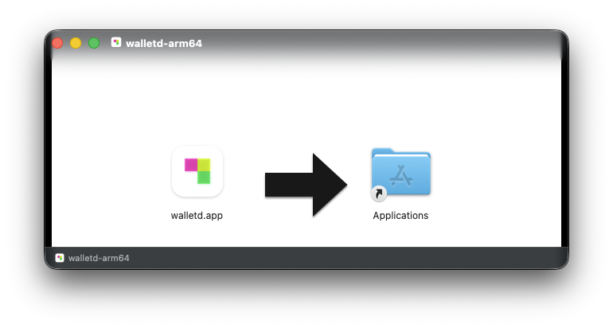
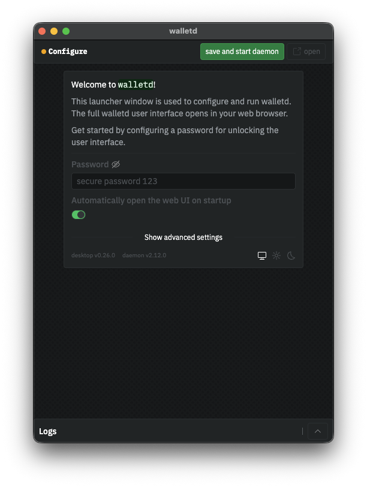
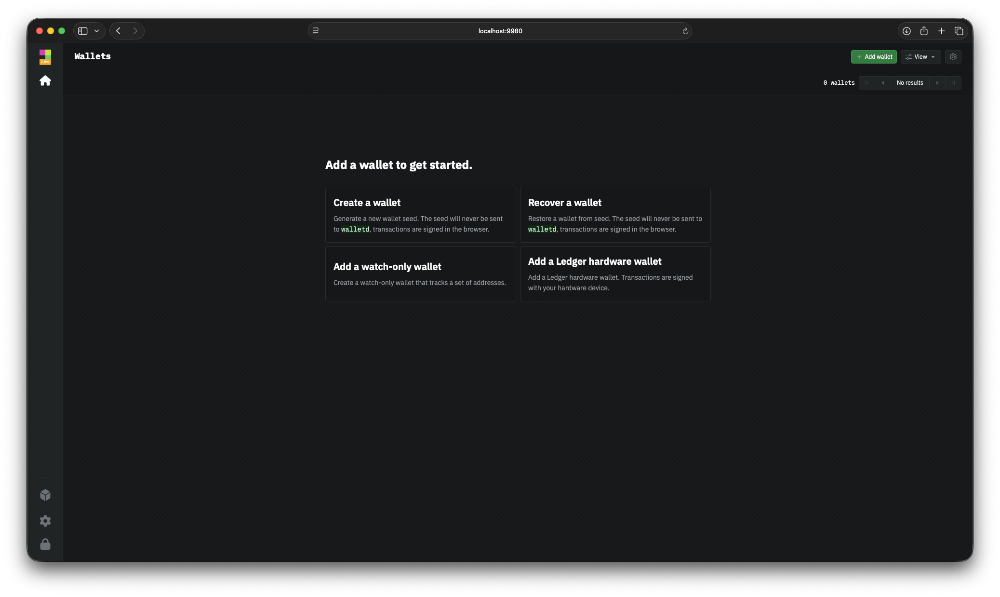

# macOS Desktop App: `walletd`

The `walletd` desktop app provides a user-friendly web UI to manage your Sia wallets. By the end of this guide, you will have:

* Installed the `walletd` desktop application.
* Created a `walletd` wallet

## Pre-requisites

To run `walletd` on macOS, your system should meet the following specifications:

* **System Updates:** Ensure that your macOS version is up to date with the latest system updates. These updates can contain important security fixes and improvements.

* **Hardware Requirements:** A stable setup that meets the following specifications is recommended.
  - A quad-core CPU
  - 8GB of RAM
  - 256 GB SSD for `walletd`

* **Network Access:** `walletd` interacts with the Sia network, so you need a stable internet connection and open network access to connect to the Sia blockchain.

## Download


Remember to check which version to download to ensure it works correctly with your hardware. To do this, click on the Apple icon in the top left corner of your toolbar, then click on **About This Mac**. If the processor/chip says:

* **Intel** - `macOS AMD64`
* **Apple silicon (M1, M2, M3, …)** - `macOS ARM64`


1. Go to [Sia Software Downloads](https://sia.tech/software-downloads). Here you can find the latest software downloads for all our daemons.

2. From the dropdown menu, select **macOS ARM64** or **macOS AMD64** depending on your hardware.


Before proceeding with downloading, please read our [Terms of Service](https://sia.tech/terms-of-service). Once you have reviewed and are satisfied, check the box to agree.


3. Click **Download** to get the latest `walletd` version for your hardware.

## Run

After downloading the `walletd` desktop application:

1. **Install the app:** Open the downloaded `.dmg` and drag the `walletd` app into your **Applications** folder.

2. **Launch the app:** Open `walletd` from your Applications folder or Launchpad like any other program.
3. **Initial setup *(first-time users only)*:** On first launch, the Welcome to `walletd` window will guide you to set a password to access the web UI. After entering your desired `API password`, `walletd` will start.

4. **Access the Web UI:** Click **save and start daemon**. It will open automatically, or if not, you can access it at [http://localhost:9980](http://localhost:9980) while `walletd` runs in the background.


When you first run `walletd`, macOS may ask to allow incoming network connections. This is normal — select **Allow** so `walletd` can communicate properly.



**Success!** `walletd` is now running on your Mac, and you’re ready to start managing your wallets on the Sia network.


## Configure

You can customize `walletd` through the desktop app, which provides full control over all available settings, from wallet indexing to batch sizing and more.

On **macOS**, you can access the `walletd` configurations by clicking the `walletd` icon in the menu bar at the top of your screen. This will open the configuration window and let you customize its behavior.

There are several configurable settings in `walletd`. Below is a breakdown of what each setting does:

| Field | Description |
|------|-------------|
| Password | Set or update your wallet password |
| Automatically open the Web UI on startup | Enable this to launch the interface when `walletd` starts |
| Data Directory | Where `walletd` stores its data and config files |
| HTTP Address | Local address for the Web UI |
| Log Level | Amount of detail in logs |
| Index Mode | Indexing scope of either `personal` (your addresses), `full` (entire chain), or `none` (read-only). |
| Index Batch Size | Number of blocks processed per batch during indexing |
| Consensus Network | Connect to either `mainnet` (live network) or `zen` (test network) |
| Syncer Gateway Address | Address for connecting to a gateway node for syncing (optional) |
| Syncer Bootstrap | Enable for discovering and syncing with the network |
| Syncer Enable UPnP | Enable Universal Plug and Play (UPnP) to automatically configure router port forwarding for incoming connections |


Always **save and restart daemon** after making configuration changes to ensure they are applied.


You can monitor your node’s activity and track changes by checking the logs. These provide detailed information about the system, network connections, and API endpoints, helping you understand what your node is doing at any given time.

## Update

`walletd` updates regularly with bug fixes, performance improvements, and new features. Updating your node ensures stability and compatibility with the Sia network.

On macOS, the app downloads updates automatically and notifies you when they’re ready. Simply restart the app to run the latest version.


You can always check for the version of the software at the bottom of the app interface.

