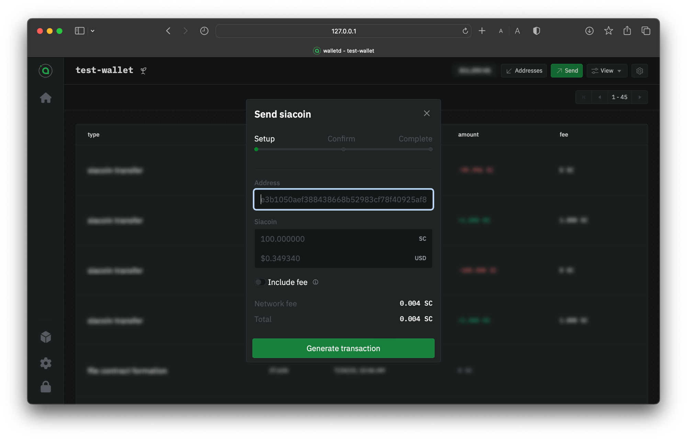
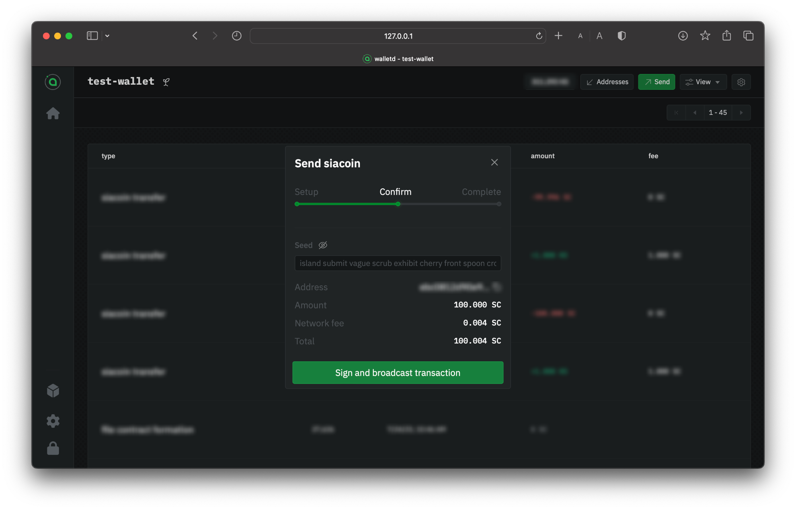
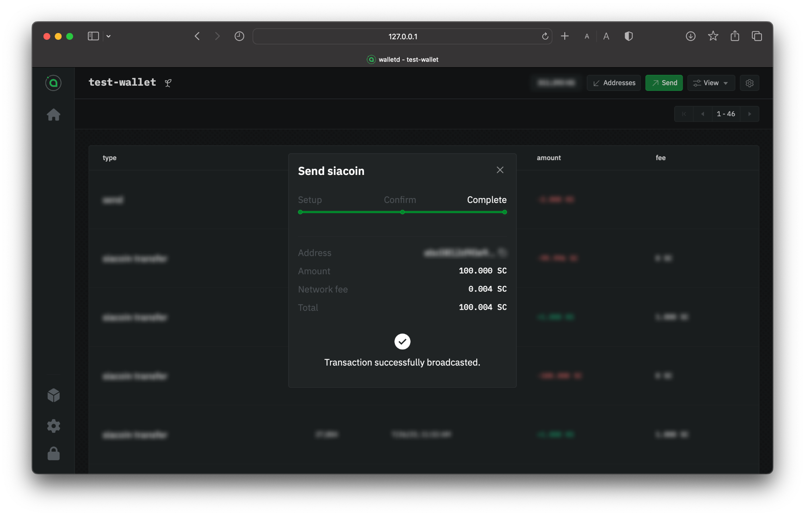
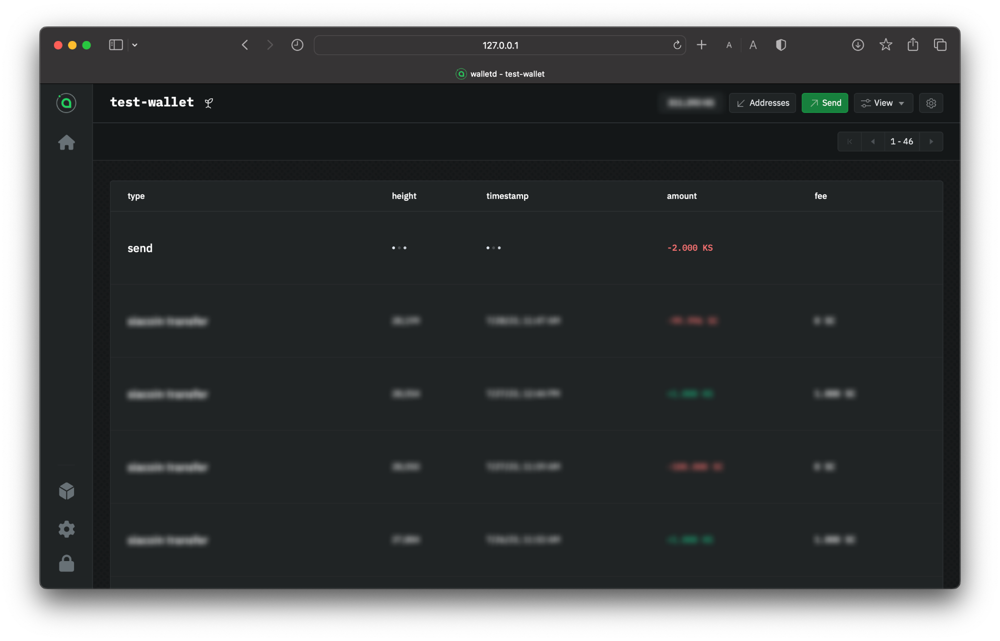
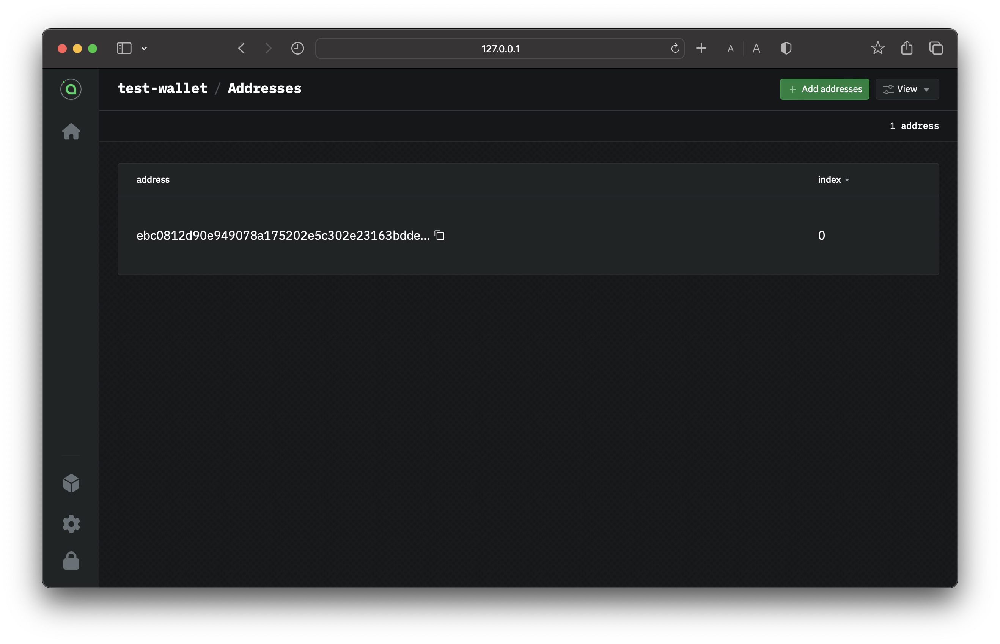

---
layout:
  title:
    visible: true
  description:
    visible: true
  tableOfContents:
    visible: true
  outline:
    visible: true
  pagination:
    visible: true
---

# Transferring Siacoins

## Sending Siacoins

Whether you're sending Siacoins (SC) to an exchange or a friend, it's easy and can be done right. You can check the transaction status by`walletd`.

Go to `walletd`. If you're asked to unlock the wallet, use your seed or a custom password if you've set one. If you haven't got a wallet set up, visit our[ Setting up `walletd`](setting-up-walletd/) guide; otherwise, choose from the **Dashboard** a wallet you wish to send Siacoins from.&#x20;

### Setup your transaction

Click on the `Send` button. Enter the recipient's wallet address and the amount of Siacoins you want to send. Make sure that you've entered a Siacoin wallet address and that you've entered it correctly.

<figure><figcaption>
Sending Siacoins via walletd
</figcaption></figure>


Siacoins sent to mistyped addresses or addresses of other types of cryptocurrency can not be retrieved.


Click **Generate Transaction.**

### Confirm your info

Next, you need to confirm everything. You'll have a chance to double-check the currency, amount, and recipient address. The window will also show you estimated network fees.

For security measures, you will also be asked to provide your Seed.

<figure><figcaption>
Confirming your transaction
</figcaption></figure>

Click **Setup** to change something. If it's all good, click **Sign and broadcast transaction**.

<figure><figcaption>
Confirmation of a successful transaction broadcasted
</figcaption></figure>

You'll immediately get a confirmation that your transaction has been successfully broadcasted.

### Checking the status

Go to your **Dashboard** and select the wallet you made the transaction with. It's normal to see **Unknown** or **Send** at the top of the list; the transaction is on its way but hasn't yet appeared in a block.

<figure><figcaption>
Wallet transaction list
</figcaption></figure>


It might take a minute or two to appear in the wallet's transactions list.


Once it's in a block, you can check the status and see a new transaction type of **siacoin transfer**.

## Receiving Siacoins

At some point, you'll need to receive Siacoins. You might be receiving them from an exchange wallet, another Sia wallet you own, or requesting Siacoins from a friend. No matter the reason, it's easy to generate or retrieve your address in `walletd` to receive Siacoins.

Go to the `walletd`. If you're asked to unlock the wallet, use your seed or a custom password if you've set one. If you haven't got a wallet set up, visit our [Setting up walletd](setting-up-walletd/) guide; otherwise, choose from the **Dashboard** a wallet you wish to receive Siacoins from.&#x20;

Click on the **Addresses** in the top right corner, and you'll be presented with the wallet address.

<figure><figcaption>
Wallet addresses
</figcaption></figure>

### Sharing the address or QR

Copy and paste your address manually, or use the **Copy** button to the right to ensure you get the full address without any extra spaces, and provide this address to whomever you're receiving the fund from.

You can also receive Siacoins by sharing your QR code for others to scan.

<figure><figcaption>
Getting the address and QR of your wallet
</figcaption></figure>

You can check the transaction status by going to your **Dashboard** and selecting the wallet you made the transaction with. It's normal to see **Unknown** at the top of the list of transactions; it means the transaction is on its way but hasn't yet appeared in a block.


The transaction might take a minute or two to appear in the wallet's transactions list.


Once it's in a block, you can check the status and see a new transaction type of **siacoin transfer**.
