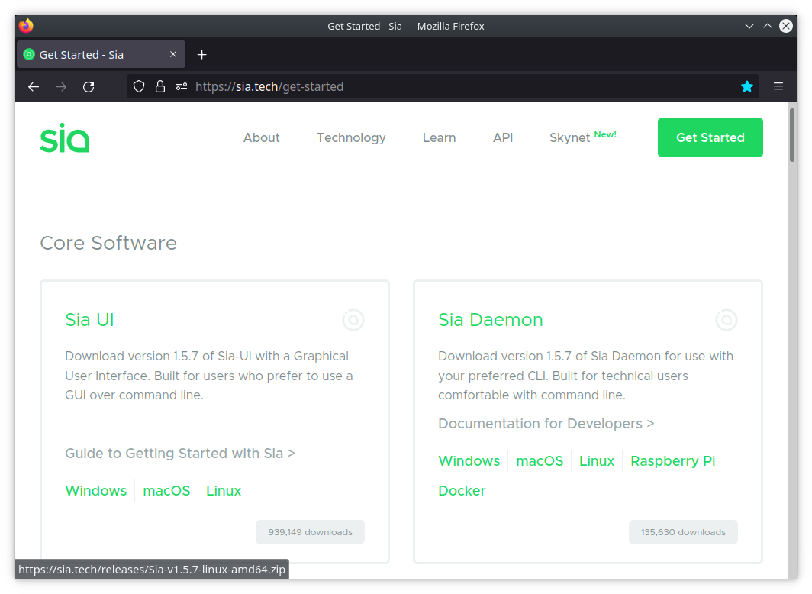

# How do I install the Sia Daemon?

## Things You'll Need

* A desktop or notebook computer with a decent amount of available storage space.
* A basic knowledge of your computer's file structure.


_As of April 21, 2022, the Sia blockchain is \~34 GB in size. This will only get larger, so make sure to allocate enough space to account for future growth._


## Download the Sia Daemon 

[Go to our downloads page](https://sia.tech/get-started). You'll see two options, Sia-UI and Sia Daemon. The Sia-UI is our user-friendly app, while the [Sia Daemon](./) is for users comfortable with command-line interfaces. Download the Sia Daemon that's right for your operating system.

Once you have downloaded the correct version of the Sia-UI, you can move on to installing it for your system.

* [Windows](how-do-i-install-the-sia-daemon.md#installation-windows-and-linux)
* [macOS](how-do-i-install-the-sia-daemon.md#installation-macos)
* [Linux](how-do-i-install-the-sia-daemon.md#and-linux)

## Installation: Windows

## Installation: macOS

## Installation: Linux

## Installation: Raspberry Pi

## Installation: Docker
