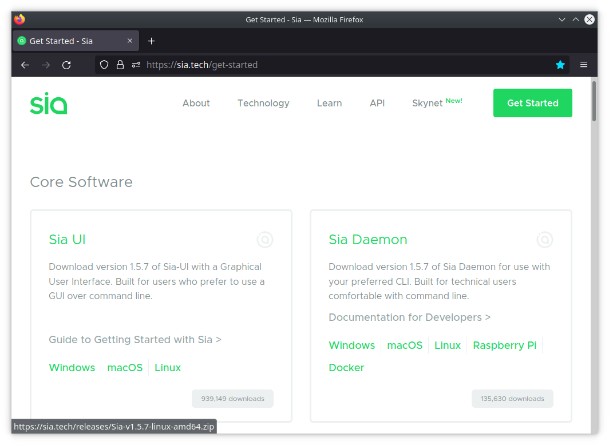
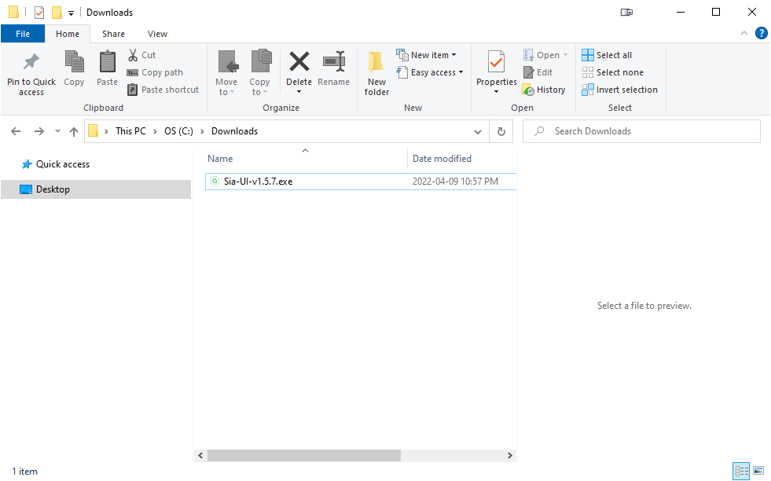
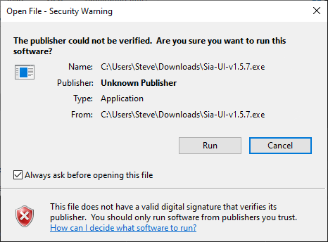
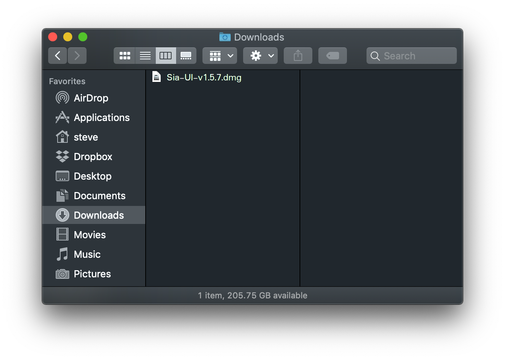
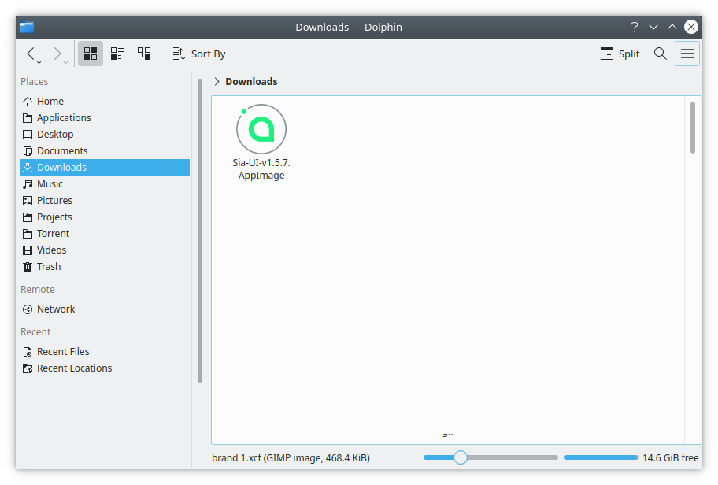
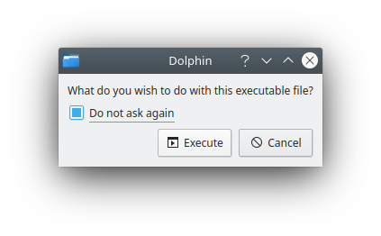

# Installing the Sia-UI

## Things You'll Need

* A desktop or notebook computer with a decent amount of available storage space.
* A basic knowledge of your computer's file structure.


_As of April 21, 2022, the Sia blockchain is \~34 GB in size. This will only get larger, so make sure to allocate enough space to account for future growth._


## Download the Sia-UI 

To begin, [download the Sia-UI](https://sia.tech/get-started).&#x20;

On our downloads page you will see two options, Sia-UI and Sia Daemon. The Sia-UI is our user-friendly app, while the Sia Daemon is for users comfortable with command-line interfaces. Download the Sia-UI that's right for your operating system.

Once you have downloaded the correct version of the Sia-UI, you can move on to installing it for your system.

* [Windows](how-to-download-and-install-sia-ui.md#installation-windows)
* [macOS](how-to-download-and-install-sia-ui.md#installation-macos)
* [Linux](how-to-download-and-install-sia-ui.md#installation-linux)

## Installation: Windows

Once you have downloaded the latest version for your system, browse to the `.exe` file. Typically it will be in your Downloads folder.\
\
To do this, access your File Explorer and navigate to your Downloads folder. In this example, the file is called `Sia-UI-v1.5.7.exe`.

Double click on this file to start the installation.

Before Sia-UI launches, you'll likely see a warning that the app is from an unknown publisher. This is standard whenever you try to open an app that is not on your OS developer's approved list. In this case, Sia-UI is from Nebulous, the company the employs the Sia development team. Click **Run.**

Sia-UI will inform you that it's installing.

Your computer is going to double-check with you about installing Sia-UI. If you see: `Do you want to allow this app form an unknown publisher to make changes to your device?`, click **Yes.**

Depending on your installed security software, you may also see a warning regarding network access or some other security precaution. In this example, Windows Defender is asking if siad.exe, the primary file that Sia uses to operate, is allowed to communicate on the network. Click **Allow access.**

Once the Sia-UI loads you're now ready to go!


Was this your first time installing? [Make sure to set up a wallet](how-to-make-a-new-wallet-in-sia-ui.md#create-a-new-wallet).


## Installation: macOS

Once you have downloaded the latest version for your system, browse to the `.dmg` file. Typically it will be in your Downloads folder.\
\
To do this, access your Finder and navigate to your Downloads folder. In this example, the file is called `Sia-UI-v1.5.7.dmg`.

Double click on this file to start the installation.

A new window will appear, with the Sia-UI icon, an arrow, and an image of your Applications folder.

Drag the Sia-UI icon to the Applications folder and let go. Sia-UI has now been installed.


If you had another version of Sia-UI previously installed, you'll be asked to overwrite it. It's ok to do this - you're installing the latest version.


You can now open your Applications folder from your Finder to locate the app.

When you first attempt to open Sia-UI, you'll likely see a warning that you are opening an app from an unidentified developer. This is standard whenever you try to open an app that is not on Apple's approved list. Click **OK.**

As of macOS 10.15 Catalina, you may be notified that Sia-UI may contain malicious software. **Sia-UI is safe to use**, but since it hasn't been pre-verified with Apple they give a warning to be extra safe. To install, either go to System Preferences > Security and Privacy, and click Allow, or right-click the app icon and choose Open.

We need to tell your Mac that Sia-UI is safe to run. Navigate to System Preferences, which can be accessed by clicking on the Apple in the upper left corner of your screen. Once there, click on **Security and Privacy.** This is in the first row of icons.

The next screen will open to the General tab, which is exactly where you need to be. Towards the bottom of the window, you'll see the message: "Sia-UI was blocked from opening because it is not from an identified developer." Click **Open Anyway** to the right.

You might see one more message letting you know that Sia-UI is from an unidentified developer. Click **Open.**

Once the Sia-UI loads you're now ready to go!


Was this your first time installing? [Make sure to set up a wallet](how-to-make-a-new-wallet-in-sia-ui.md#create-a-new-wallet).


## Installation: Linux

Once you have downloaded the latest version for your system, browse to the `.appimage` file. Typically it will be in your Downloads folder.\
\
To do this, access your Finder and navigate to your Downloads folder. In this example, the file is called `Sia-UI-v1.5.7.appimage`. Once located you can move this file to your Desktop or any other preferred location.

Double click on this file to launch the Sia-UI.

If you get a pop up dialog asking what to do. Click "Execute".

Once the Sia-UI loads you're now ready to go!


Was this your first time installing? [Make sure to set up a wallet](how-to-make-a-new-wallet-in-sia-ui.md#create-a-new-wallet).

